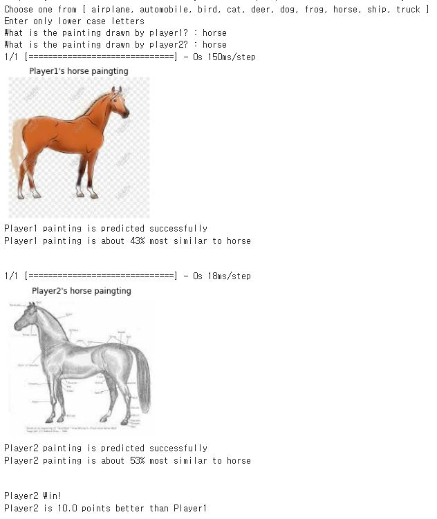

# Painting-Battle 
## 누구의 그림이 실제와 더 비슷할까?
## 

### Contents
1. Description
2. Result Example
3. Model 
4. References
5. License
6. Attachment Files
---
### Description
#### Painting Battle에 대한 전반적인 설명
* 해당 프로젝트는 코랩에서 진행되었다.
* Keras library 자체에서 제공하는 CIFAR-10 datasets을 불러왔다.
* CIFAR-10 datasets을 이용하여 모델을 학습시켰다.
* 그 모델이 플레이어가 그린 그림에 대해 예측한 결과(퍼센트)를 점수로 반환하여 플레이어 간 점수를 겨루는 게임
#### Painting Battle 플레이 방법
1. 플레이 전 airplane, automobile, bird, cat, deer, dog, frog, horse, ship, truck 총 10가지 중 한가지 씩 선택하여 그린 그림을 이미지 파일로 저장한 후 각 이미지 파일의 경로를 코드에 입력  
 
2. player1, player2가 각각 그린 그림의 주제에 대해 입력 ( 잘못된 입력이 왔을 경우 : 올바른 입력을 할 때까지 재입력 수행 )  
     
3. cifar10 datasets을 통해 학습한 모델이 플레이어 각각의 그림을 예측, 그 결과를 플레이어의 점수로 환산 후 게임의 승패가 결정!  
**점수 환산 방법**  
플레이어가 그린 그림의 주제와 모델이 가장 높은 확률로 예측한 그림의 주제가 일치하면 +50점  
플레이거가 그린 그림의 주제와 모델이 가장 높은 확률로 예측한 그림의 주제가 불일치하면 +0점  
그 후 플레이어가 그린 그림의 주제로 모델이 예측한 확률 * 100 을 추가 점수로 부여 (소수점 첫째자리에서 반올림 진행)  
*ex) player1 자동차를 그림 -> 모델이 자동차로 예측함(+50점) + 약 68%의 정확성을 가짐(+68점) = 약118점*
---
### Result Example
**Tip - 실제 이미지와 그림을 비교하므로 실사와 가까운 그림일수록 높은 점수를 얻음!**  
*주의사항 - 각 그림에 대해 예측 결과는 수행마다 달라짐*
* 각 player의 그림과 그 그림에 대한 예측 결과를 보여줌  
* 게임의 승자와 플레이어 간의 점수 차를 보여줌  
 
1. 두 명의 그림 모두 실제와 가까운 경우
 
2. automobile, truck과 같이 비슷한 류끼리 혼동되는 경우  

3. 플레이어가 의도한 그림과 모델이 다르게 예측한 경우  

---  

### Model
* [kaggle에서 제공하는 cifar10 datasets](https://www.kaggle.com/datasets/oxcdcd/cifar10)을 CNN(Convoutional Neural Networks)을 이용하여 모델을 학습시킴
* 모델 구성시, [Keras CIFAR-10 CNN Source Code](https://bcdeep.tistory.com/6) - CNN 모델의 기본적인 구현 방식 참조 
  * ImageDataGenerator -> train 이미지 수 증강
  * hidden layer 추가 -> 정확도 증가
  * Dropuout, BatchNormalization 추가 -> 과적합 해결
  * 높은 정확성을 가지도록 batch_size, epochs 값 설정
   
* Performace  
정확도 약 80%를 가짐, 정확도 증가 및 과적합 문제 해결    
 
---
### References
* [Keras CIFAR-10 CNN Source Code](https://bcdeep.tistory.com/6) : CNN모델에 맞게 데이터 전처리 방식, CNN모델 구성하는 방식 참조
---
### License
* MIT License
---
### Attachment Files
* Paintings - 플레이어들의 그림들이 들은 파일
* Description - 사용자의 입력을 받는 상황들에 대한 캡쳐들이 들은 파일
* Result - 실행한 예시 결과들이 들은 파일
* Model - 모델 구조 및 성능에 대한 캡쳐 파일
